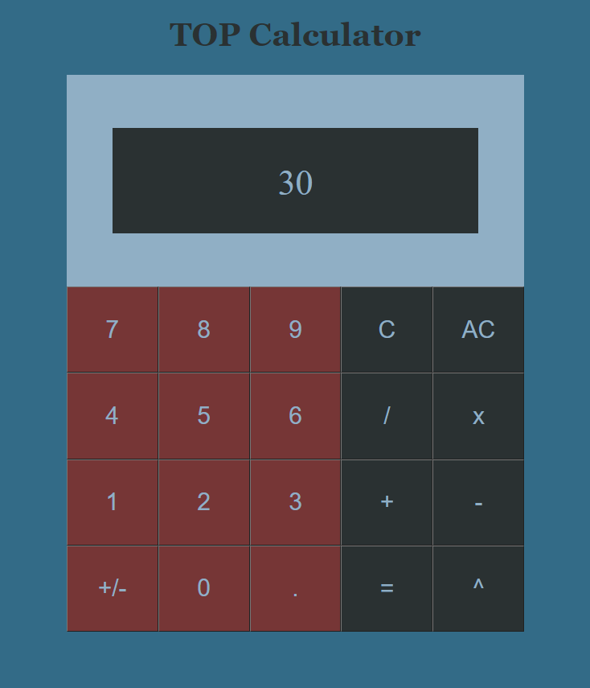

# Calculator

Programmed a calculator that runs in the browser to perform basic mathematical computations such as addition, subtraction, division, and exponentiation. The program works with positive, negative, and decimal numbers (which it will round to three digits). The primary purpose of this project was to practice using JavaScript in conjunction with event listeners, but I also gained some more familiarity with the using the CSS grid layout at the same time.

# Demo:

