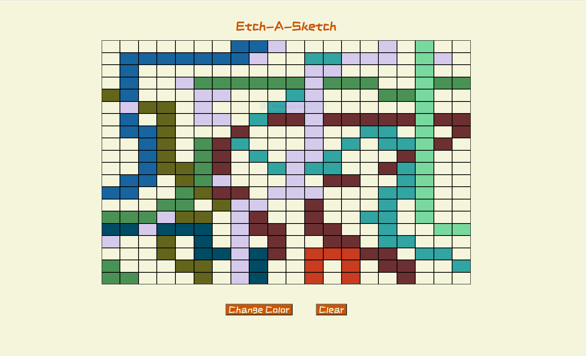

# Etch-A-Sketch

This project was completed as a way to practice manipulating the DOM using JavaScript. It serves
as a simple Etch-A-Sketch, allowing the user to fill in a grid with different colors. My version
allows the user to clear the grid, randomize the fill color, and change the number of tiles on
the grid.

# Demo:

