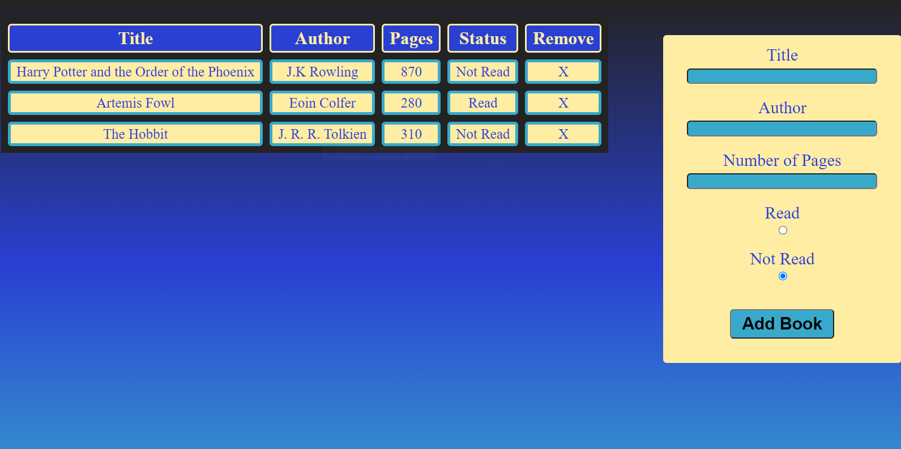

# Library

Created a simple user interface to display a list of books and relevant information about them, including title, author, number of pages, and whether or not the book has already been read by the user. When a user is finished reading a book, they are able to update the status of the book to "Read" from "Not Read". Users are also able to add books to the library by submitting information on the right side of the page as well as remove books they no longer wish to display in their library.

# Demo:

