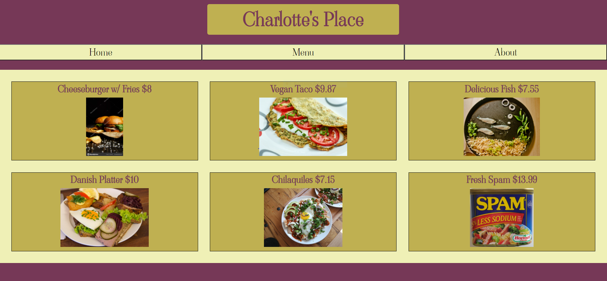

# Restaurant Page

Created a website for an imaginary restaurant, which has three separate pages: a home page, a menu page, and an about page. This project was my first time using webpack, and it allowed me to practice using webpack in conjunction with multiple JS files and npm scripts. It is also the first project where the source folder is separate from the distribution folder because of the (very small) build process.

# Demo:

