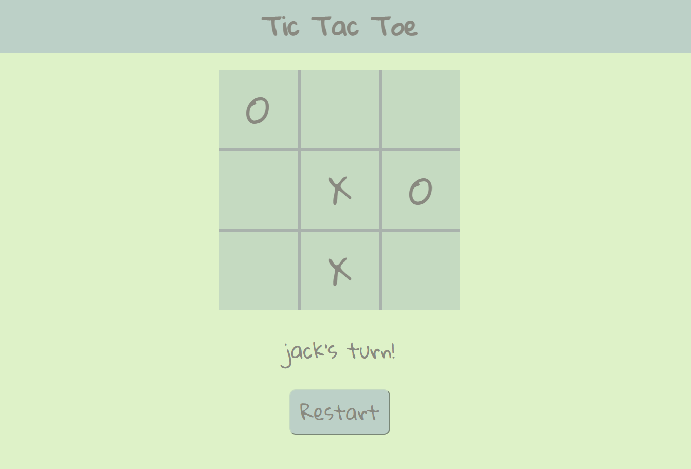

# Tic Tac Toe

Created a simple, clean user interface for playing a two player game of Tic Tac Toe. One of the largest reasons for doing this project was to practice writing modular, maintainable code. Although my code works properly, I don't feel as if it is very clean or modular, so I should come back at some point to refactor it.

# Demo:

