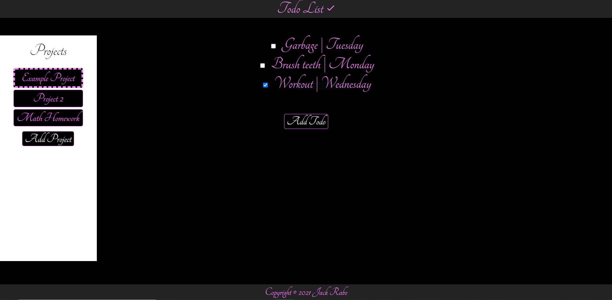

Created a simple todo list application that can be used to associated tasks due on specific dates with other tasks related to a similar project. I struggled again to separate the logic from the DOM manipulation. I may be able to improve this in the future by spending more time planning out the project beforehand and separating code into more meaningful files.

# Demo:

